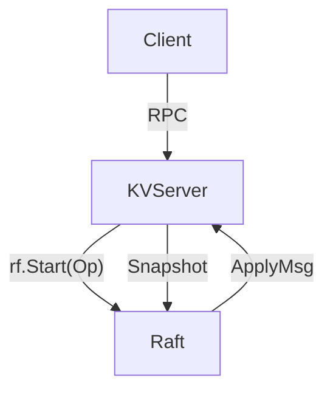
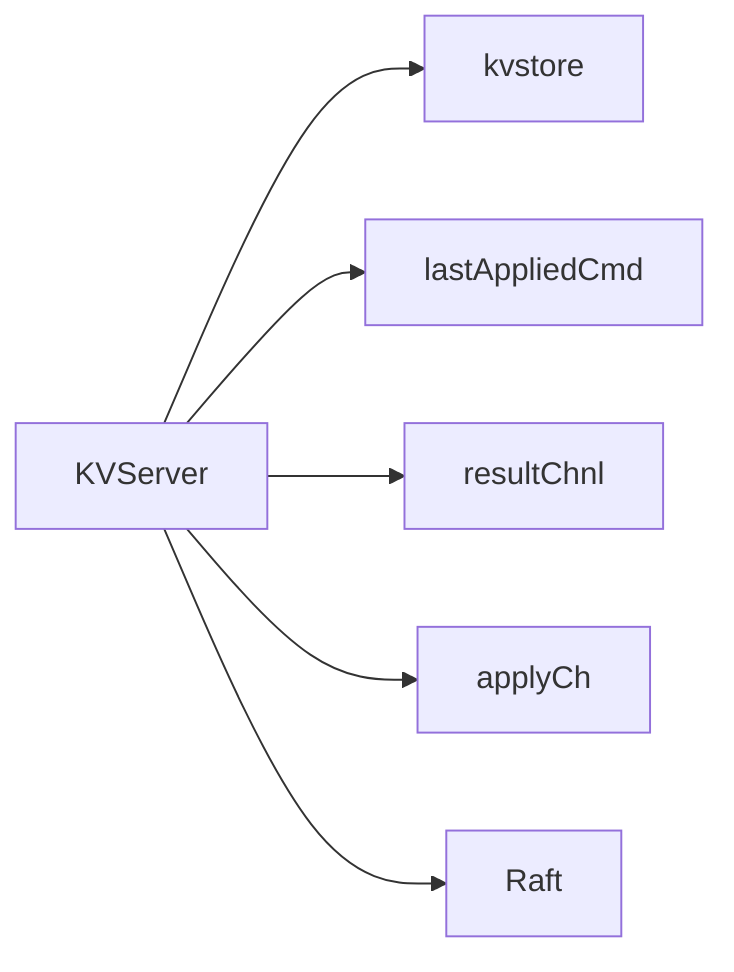
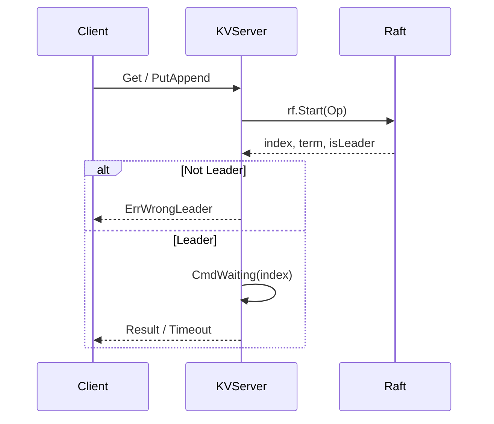
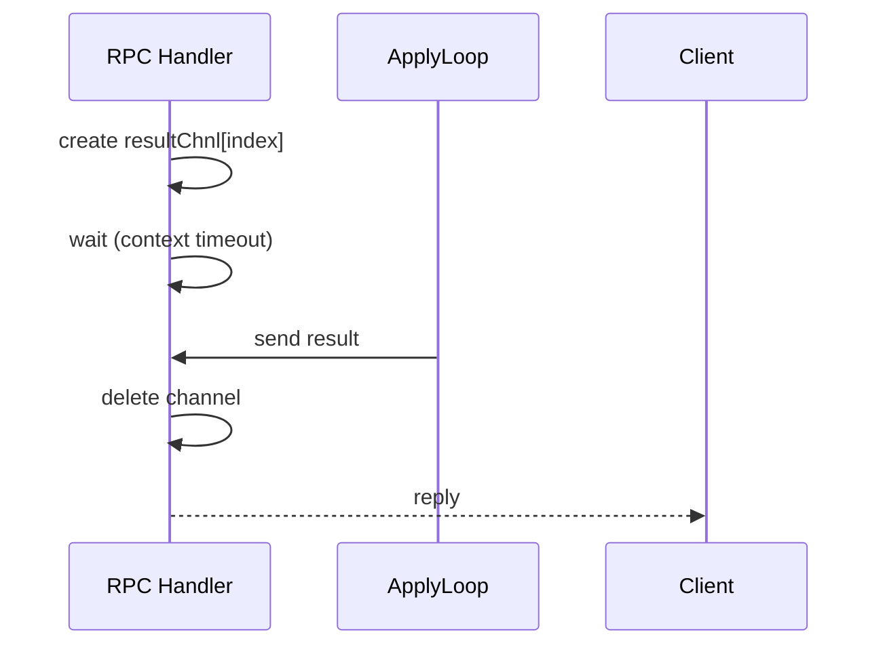
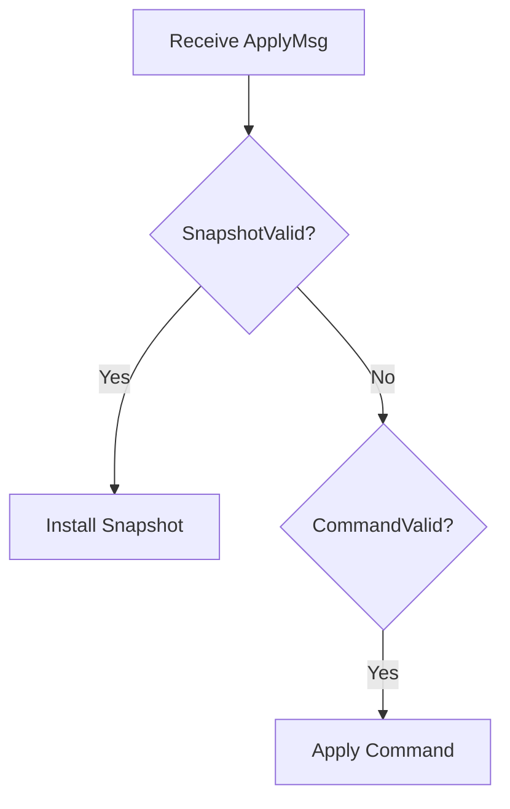
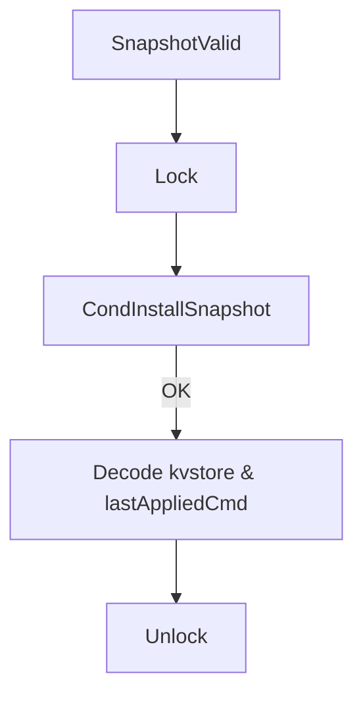
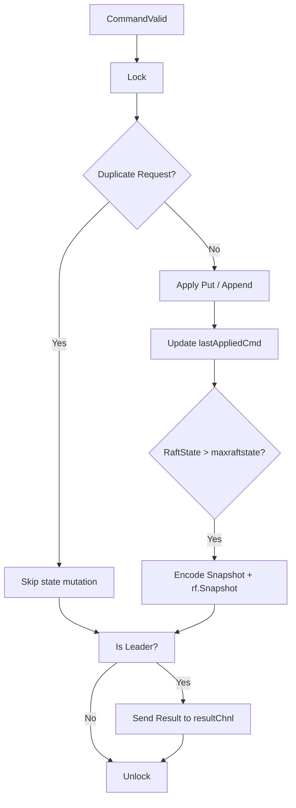
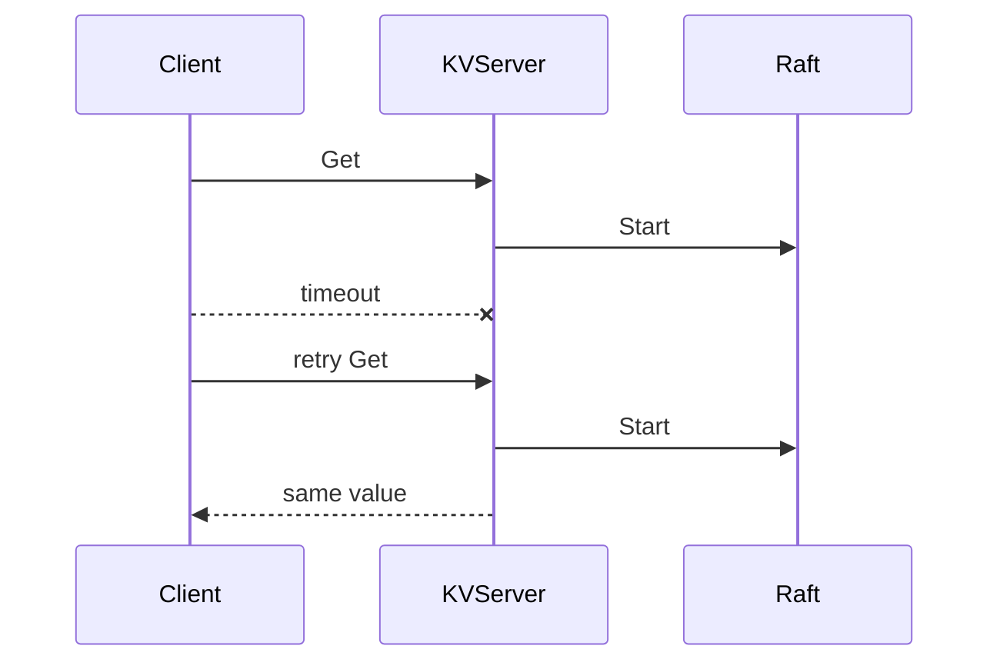

# 📘 MIT 6.824 — Lab3 KVServer 设计与流程说明

> **摘要**
>
> * MIT 6.824 Lab3：Fault-tolerant Key/Value Service
> * 基于 Raft 的线性一致 KV 存储
> * 不引入 result cache
> * Get 请求允许重复执行
>
> 总结当前 KVServer 实现的**整体架构、执行流程与关键设计取舍**。

---

## 一、整体架构（Lab3）



### 架构职责划分

| 组件       | 职责                       |
| -------- | ------------------------ |
| Client   | 发起 Get / Put / Append 请求 |
| KVServer | 状态机、幂等控制、RPC 等待          |
| Raft     | 日志复制、Leader 选举、提交顺序      |
| Snapshot | 控制 Raft 日志大小             |

---

## 二、KVServer 内部结构



### 核心状态说明

| 字段               | 含义                            |
| ---------------- | ----------------------------- |
| `kvstore`        | KV 状态机（map[string]string）     |
| `lastAppliedCmd` | ClientId → LastRequestId，用于幂等 |
| `resultChnl`     | LogIndex → chan OpResult      |
| `applyCh`        | Raft 向状态机提交 ApplyMsg          |

---

## 三、客户端请求处理流程

### 1️⃣ RPC → Raft Start



**设计要点**

* KVServer **不直接执行请求**
* 所有请求都必须经过 Raft 日志
* 非 Leader 立即返回 `ErrWrongLeader`

---

### 2️⃣ CmdWaiting（RPC 等待模型）



**说明**

* 使用 **Raft log index** 作为等待 key
* 不依赖 ClientId / RequestId 做等待
* 超时后由 Client 进行重试

---

## 四、ApplyLoop 总体流程



---

## 五、Snapshot Apply 流程



### Snapshot 内容

```text
- kvstore
- lastAppliedCmd
```

Snapshot 用于：

* 恢复 KV 状态
* 恢复客户端幂等信息
* 与 Raft 日志截断保持一致

---

## 六、Command Apply 详细流程



---

## 七、幂等与重复请求处理策略

### Duplicate 判断逻辑

```go
lastReqId, ok := lastAppliedCmd[op.ClientId]
duplicate := ok && op.RequestId <= lastReqId
```

### 不同操作的行为

| Op 类型  | 是否检查重复 | 执行策略   |
| ------ | ------ | ------ |
| Put    | 是      | 仅首次生效  |
| Append | 是      | 仅首次生效  |
| Get    | 是      | 允许重复执行 |

📌 **原因**

* Get 是只读操作
* 不维护 result cache
* 重复执行不会破坏一致性

---

## 八、为何 Lab3 不引入 result cache

### Get 超时重试场景



结论：

* 状态未改变
* 结果一致
* 额外一次 Raft 提交 **性能可接受**

---

## 九、Snapshot 触发条件

```go
if maxraftstate != -1 &&
   rf.GetPSRaftSize() > maxraftstate {
    rf.Snapshot(index, data)
}
```

### Snapshot 目标

* 控制 Raft 日志体积
* 降低恢复成本
* 保证线性一致性

---

## 十、锁粒度与实现评估

| 维度    | 结论                      |
| ----- | ----------------------- |
| 正确性   | ✅                       |
| 幂等性   | ✅                       |
| 线性一致性 | ✅                       |
| 性能    | ⚠（锁粒度偏大，Snapshot 编码在锁内） |

> 性能问题在 Lab3 可接受，Lab4 进一步优化。

---

## 十一、与 Lab4 的关系

* Lab4（ShardKV / ShardCtrler） **直接复用的本设计骨架**
* ApplyLoop、幂等控制、Snapshot 机制完全一致
* Lab4 仅额外引入：

  * 多 Group / 多 Shard
  * 配置变更日志
  * Shard 迁移流程
* Lab4 优化部分：
  * Get/Query 的缓存机制避免 Get 的重复操作
  * SnapShot 的解锁编码，避免编码过程的时间过长导致大面积的功能阻塞

* 是 Lab4 的可靠基础模板

