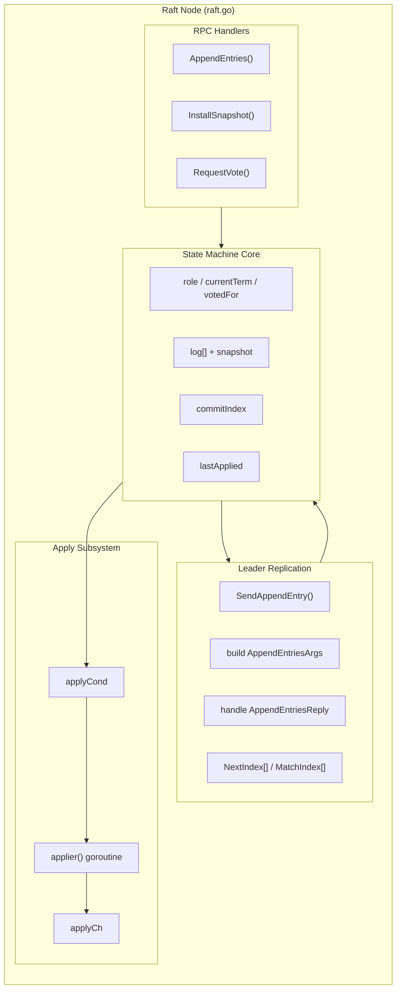
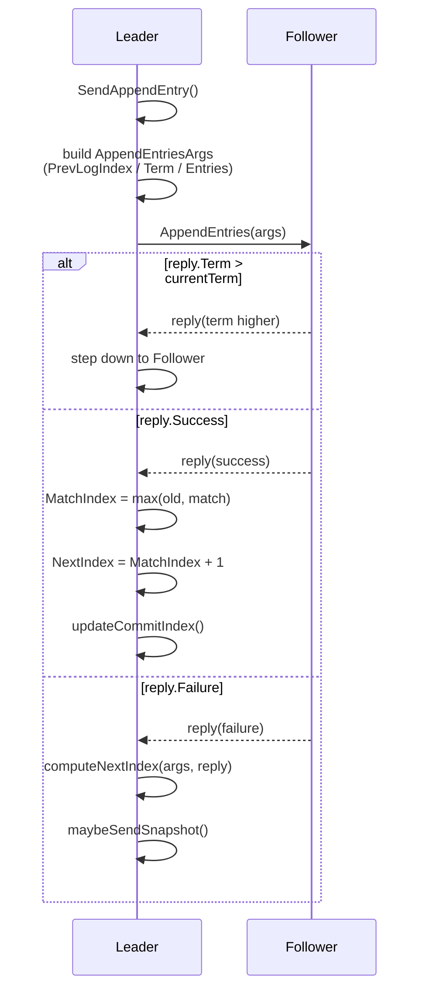

# **Lab2（MIT 6.824）系统性总结**

---

# 一、Lab2 测试用例整体在验证什么？

> **Raft 在并发 + 故障 + 时序不确定性下，是否仍然维持协议不变式（invariants）**

---

# 二、Lab2 覆盖的 Raft 特性

## 1️⃣ Leader Election（2A）

### 测试验证的核心点

| 维度   | 验证内容                    |
| ---- | ----------------------- |
| 安全性  | 同一 term 只能有一个 leader    |
| 活性   | 在无 leader 时，能选出新 leader |
| 稳定性  | 心跳存在时，不会频繁重新选举          |
| 任期递增 | term 单调递增，旧 leader 不复活  |

### 不变条件（invariants）

> **Leader 的存在是“时间连续”的，而不是事件驱动的**

---

## 2️⃣ Log Replication & Commit（2B）

### 测试验证的核心点

| 维度                  | 验证内容                      |
| ------------------- | ------------------------- |
| Prefix Match        | follower 日志始终是 leader 的前置 |
| Commit Rule         | 只有多数派确认的日志才能 commit       |
| Leader Completeness | 已提交日志不会被后续 leader 覆盖      |
| 并发安全                | Start() 并发调用不会乱序          |

### 非常重要但“测试隐含”的语义

> **Append ≠ Commit ≠ Apply**

---

## 3️⃣ Persistence（2C）

### 测试验证的核心点

| 场景             | 验证内容                       |
| -------------- | -------------------------- |
| crash-restart  | term / votedFor / log 正确恢复 |
| vote safety    | 重启后不会重复投票                  |
| log continuity | 不会回滚已持久化日志                 |

### 核心不变式（invariants）

> **任何可能影响未来决策的状态，必须持久化**

---

## 4️⃣ Snapshot & Log Compaction（2D）

### 测试验证的核心点

| 维度       | 验证内容                        |
| -------- | --------------------------- |
| 空间安全     | log 能被正确截断                  |
| 同步正确性    | 落后 follower 能通过 snapshot 追上 |
| apply 顺序 | snapshot 与 log apply 严格有序   |
| 并发健壮性    | snapshot / AE / apply 并发不死锁 |

---

# 三、实现架构
### **基础架构**


### **Leader 日志复制传递**


---
**重温代码发现的问题**
## 🔥 问题 1：SendAppendEntry 是“上帝函数”

### 问题现象

* 逻辑高度耦合：

  * snapshot 判断
  * AE 构造
  * RPC
  * reply 处理
  * commit 推进

### 隐含风险

* reply 语义和发送时状态“漂移”
* snapshot fallback 变成“事后补救”

### 改进方案

> **将 AE 语义拆成“不可变 RPC 尝试”**

```text
buildAppendArgs()
sendAppendEntries()
dealAEReply(args, reply)
maybeSendSnapshot()
```

📌 **核心收益**：
reply 的解释严格绑定于发送时的 `PrevLogIndex`

---

## 🔥 问题 2：Snapshot fallback 的“事后发现问题”

### 原始问题

```go
if rf.NextIndex[server] <= rf.snapshot.LastIncludedIndex {
    needSendSnapshot = true
}
```

这是在 **AE 失败后** 才发现该发 snapshot。

### Raft 论文语义

> **如果 follower 落后到 snapshot 之前 → 直接 InstallSnapshot**

### 改进认知

* Leader **不需要“试错”**
* `NextIndex` 本身就是“是否需要 snapshot”的充分信息

---

## 🔥 问题 3（重点）：applyCond 的“边界唤醒问题” ⭐


### ❌ 原始直觉

```go
if rf.LastApplied < rf.CommitIndex {
    rf.applyCond.Signal()
}
```

**看起来合理，但是错的。**

---

### 问题本质

> **这是“状态触发”，不是“事件触发”**

导致：

* AE 心跳每次到达都会 Signal
* applier 被频繁空唤醒
* goroutine 调度风暴
* **2D 测试时间显著变长**

---

### ✅ 正确语义

> **apply 只关心一件事：
> “commitIndex 是否刚刚推进？”**

```go
oldCommit := rf.CommitIndex
rf.CommitIndex = newCommit

if rf.CommitIndex > oldCommit {
    rf.applyCond.Signal()
}
```

> **Cond.Signal 是“边沿触发”，不是“状态保持”**

---

## 🔥 问题 4：InstallSnapshot 如何唤醒 applier？

### 等待场景

* follower 正在 Wait
* 没有 AE / commit 推进
* 却收到了一个 **新的 snapshot**

### 常规做法
```go
if snapshotIndex > rf.LastApplied {
    rf.applyCond.Signal()
}
```

### 边界场景
* commit正在推进最后一条数据
* new Leader发送了最新的 snapshot

### 问题
* Leader发送的snapshot其实已经applier中正在处理的command会导致应用重复

### 解决方法
* 应用snapshot的时候对等待队列里的数据进行校验，剔除相关数据

---

# 总结

## Lab2 验证了 Raft 的哪些能力？

* 正确选主（2A）
* 安全复制（2B）
* 崩溃恢复（2C）
* 高效压缩 + 并发 apply（2D）

## 我踩过的坑

1. AE reply 语义漂移
2. Snapshot fallback 设计滞后
3. applyCond Signal 触发条件错误（重复触发导致效率下降）

## 最终得到的核心认知

> **Raft 的正确性，80% 取决于“什么时候唤醒”**

